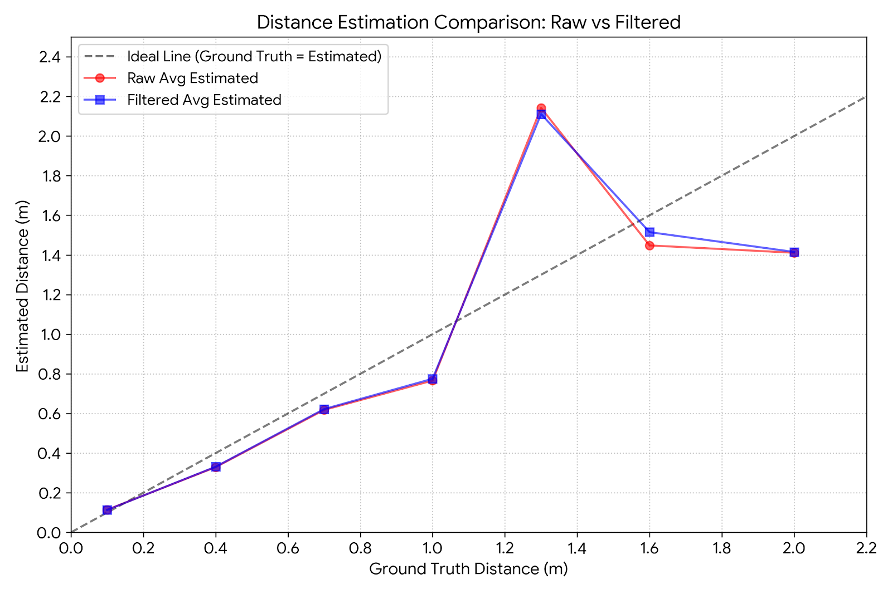

# 📡 UHF RFID Distance Estimation with Multi-Stage RSSI Stabilization

> **An embedded distance estimation system utilizing an R200 UHF RFID reader and a 5dBi antenna, featuring a custom real-time noise reduction pipeline.**

## 📌 Overview
Estimating distance using UHF RFID RSSI (Received Signal Strength Indicator) is highly susceptible to multipath fading and environmental noise. This project implements a **multi-stage hybrid filtering algorithm** directly onto an embedded system to stabilize raw RSSI data in real-time. 

By optimizing the Log-Distance Path Loss model for a specific RF environment, the system effectively suppresses signal spikes and improves distance estimation reliability under noisy conditions.

## 🚀 Key Achievements
* **Algorithmic Optimization:** Designed and implemented a lightweight, real-time RSSI filtering pipeline suitable for embedded environments.
* **Error Reduction:** Successfully suppressed multipath spikes, achieving an **8.2% reduction in RMSE**.
* **Accuracy Improvement:** Improved overall distance estimation accuracy by **9.1%p**, with near 100% reliability in short-range (< 0.4m) measurements.

---

## System Configuration

- RFID Reader: R200
- Antenna: 5dBi
- RSSI Unit: dBm
- Measurement Range: 0.1m – 2.0m
- Samples per Position: 300
- Initial Samples Ignored: 5
- Accuracy Criterion: ±0.10m

Distance model parameters:

- Reference Power (P0): -64.91 dBm
- Path-loss Exponent (n): 1.769

---

## Filtering Architecture

### 1) RSSI Domain Stabilization

- Physical threshold filtering  
  (-85 dBm ≤ RSSI ≤ -35 dBm)
- Sliding window size: 5
- Statistical outlier rejection  
  (mean ± 1.8 × standard deviation)
- Adaptive mixing:
  - Simple moving average
  - Freshness-weighted average  
  (mix ratio = 0.4)

### 2) Distance Domain Inertia Filtering

After RSSI-to-distance conversion, a position-dependent inertia factor was applied:

Filtered Distance =  
α × Previous Distance + (1 − α) × Current Estimate

This improves estimation stability in high-variance regions.

---

## Distance Estimation Model

Log-distance path loss model:

d = 10^((P0 − RSSI) / (10n))

Where:
- P0 = -64.91 dBm
- n = 1.769
- RSSI in dBm
- d in meters

---

## Experimental Results

| Metric | Raw | Filtered |
|--------|------|----------|
| MAE | 0.283 m | 0.266 m |
| RMSE | 0.442 m | 0.410 m |
| Accuracy (≤0.10m) | 41.9% | 51.0% |

---

## Visualization

### System Block Diagram

### RSSI Filtering Effect

### Distance Estimation Comparison

### Error Metrics by Distance

### Performance Improvement

- MAE reduced by 5.7%
- RMSE reduced by 8.2%
- Accuracy improved by +9.1%p

---

## Repository Structure

firmware/ → Embedded RSSI processing code
data/ → Experimental measurement data
docs/ → System architecture and experiment documentation

---

## Key Contributions

- Designed a fully embedded multi-stage RSSI stabilization pipeline
- Implemented statistical outlier rejection with adaptive weighting
- Introduced distance-domain inertia filtering for temporal stability
- Experimentally derived log-distance model parameters via multi-point regression
- Achieved measurable improvement in MAE, RMSE, and short-range accuracy

---

## 🚀 Quick Start

1. Flash firmware/main to R200 controller
2. Collect RSSI data via serial interface
3. Run calibration to estimate P0 and n
4. Process raw data using filtering pipeline
5. Evaluate performance metrics

---

## Related Publication

A detailed academic paper based on this project was prepared
as part of undergraduate research work.
