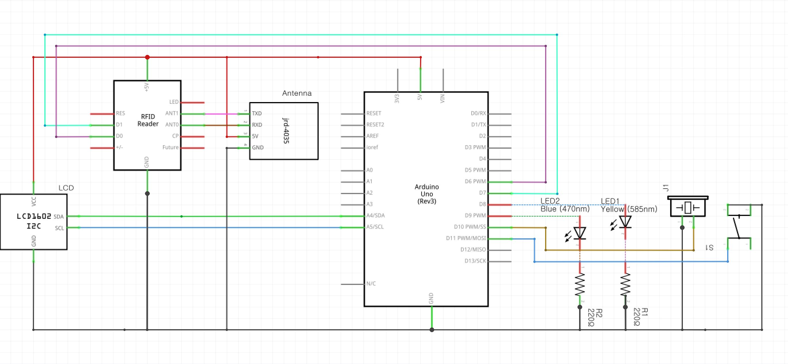
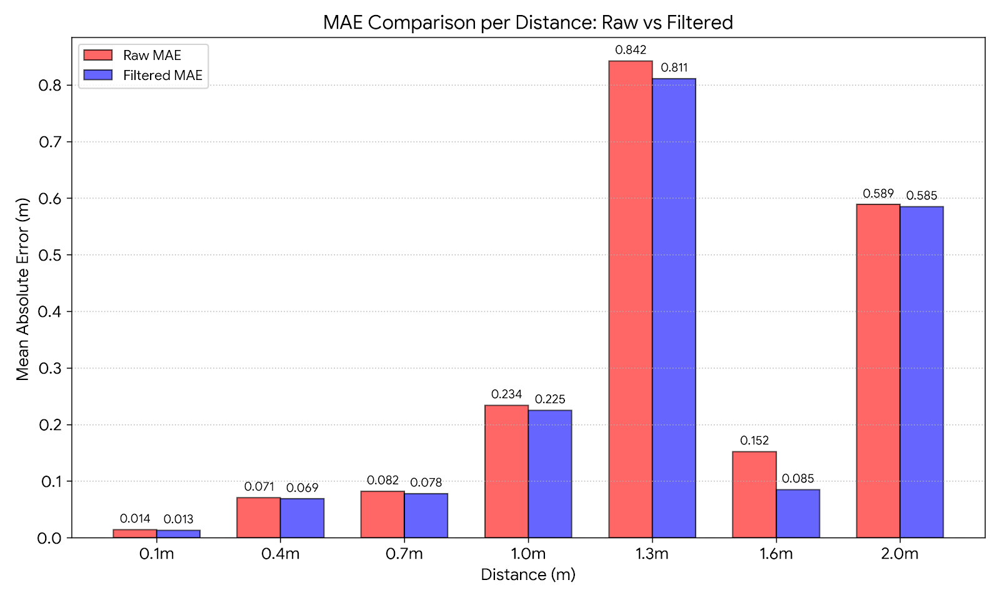
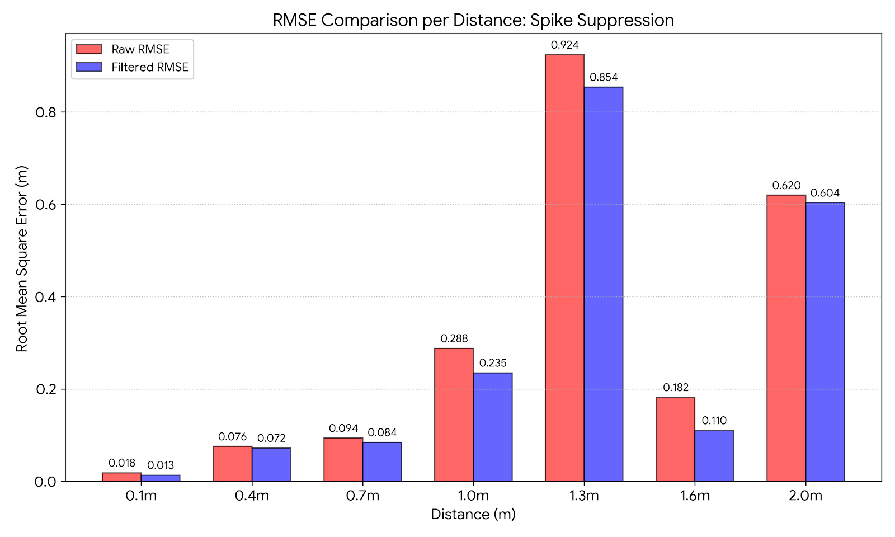
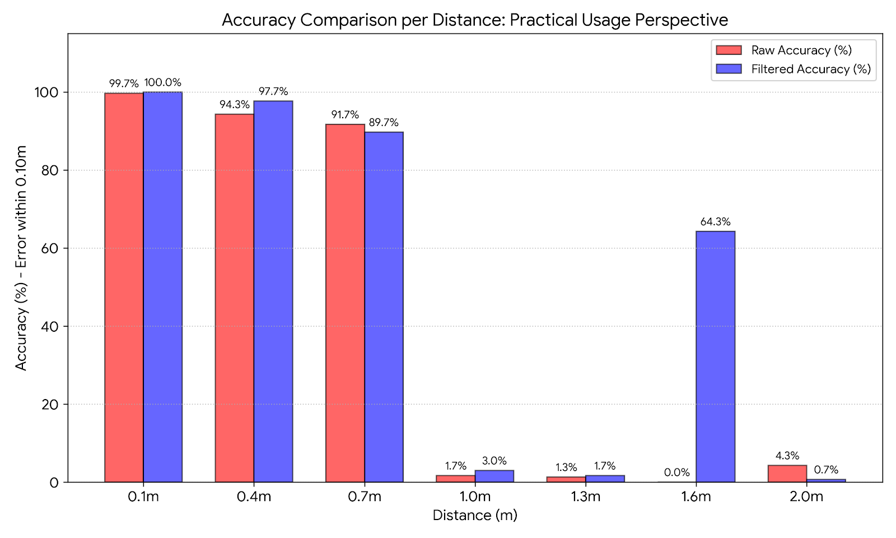

# UHF RFID Distance Estimation System
### Real-Time Embedded RSSI Stabilization & Distance Measurement on R200

---

## 🚀 Project Overview

This project implements a **real-time, embedded distance estimation system** using RSSI measurements from a **UHF RFID R200 reader** with a 5dBi antenna.  

The key goal was to **stabilize highly fluctuating RSSI signals** and improve distance estimation accuracy in short-range RFID scenarios.

**Main Achievements:**

- **MAE reduction:** 0.283 → 0.266 m (−5.7%)  
- **RMSE reduction:** 0.442 → 0.410 m (−8.2%)  
- **Accuracy within ±0.10 m:** 41.9% → 51.0% (+9.1%p)

---

## 🧩 Problem Statement

RSSI-based distance estimation is prone to **noise and spikes** due to:

- Multipath interference in indoor environments  
- RF reflections from objects and surfaces  
- Nonlinear RSSI-to-distance characteristics  
- Short-term variance in tag-reader communication  

Raw RSSI data without filtering leads to **large distance estimation errors**, particularly in mid-range measurements (1–1.5 m).

**Objective:** Develop an **embedded, lightweight filtering pipeline** that improves real-time accuracy without heavy computation.

---

## ⚙️ Hardware & Measurement Setup

- **RFID Reader:** R200  
- **Antenna:** 5 dBi  
- **RSSI Unit:** dBm  
- **Measurement Distances:** 0.1, 0.4, 0.7, 1.0, 1.3, 1.6, 2.0 m  
- **Samples per Position:** 300  
- **Initial Samples Ignored:** 5  

> RSSI values are collected via **serial communication** and processed in real-time.

**Calibration Module:**

- Arduino-based firmware to calculate **P0 (reference RSSI at 1m)** and **path-loss exponent n** using multiple distances.  
- Output values are hard-coded into the main estimation firmware.

---

## 🧮 Log-Distance Path Loss Model

Distance is estimated using the standard log-distance model:

$$
d = 10^{\frac{P_0 - RSSI}{10 n}}
$$

Where:

- \(P_0 = -64.91\) dBm  
- \(n = 1.769\)  
- RSSI in dBm, d in meters  

**Parameter Derivation:** Multi-point regression from experimental RSSI measurements at known distances.

---

## 🧹 Filtering Architecture

### 1️⃣ RSSI Domain Filtering

#### Step 1 – Physical Threshold

- Reject RSSI readings outside **−85 dBm to −35 dBm**  
- Removes physically invalid or corrupted readings

#### Step 2 – Sliding Window

- Window size = 5 samples  
- Smooths short-term variations  
- Enables local statistical analysis

#### Step 3 – Statistical Outlier Rejection

- Compute **mean (μ)** and **standard deviation (σ)** of window  
- Reject samples outside: **μ ± 1.8 σ**  
- Suppresses RF spike noise

#### Step 4 – Adaptive Mixing

$$
RSSI_{filtered} = (1 - 0.4) \cdot MA + 0.4 \cdot WMA
$$

- MA: simple moving average  
- WMA: freshness-weighted average  
- Preserves responsiveness while smoothing

---

### 2️⃣ Distance Domain Inertia Filtering

After RSSI → distance conversion:

$$
D_{filtered} = \alpha D_{prev} + (1-\alpha) D_{current}
$$

- **α**: position-dependent inertia factor  
- Reduces temporal fluctuation  
- Improves stability in high-variance zones

---

## 🖼️ System Architecture

  

**Pipeline Summary:**

1. RSSI Acquisition → 2. Threshold Filtering → 3. Sliding Window → 4. Outlier Rejection → 5. Adaptive Averaging → 6. Log-Distance Conversion → 7. Inertia Filtering → Final Distance

---

## 📊 Experimental Results

### Overall Performance

| Metric | Raw | Filtered |
|--------|------|----------|
| MAE | 0.283 m | 0.266 m |
| RMSE | 0.442 m | 0.410 m |
| Accuracy (±0.10 m) | 41.9% | 51.0% |

---

### Distance-Wise Metrics

| Distance | Raw MAE | Filt MAE | Raw RMSE | Filt RMSE | Raw Acc (%) | Filt Acc (%) |
|----------|---------|----------|----------|-----------|-------------|--------------|
| 0.1 m    | 0.014   | 0.013    | 0.018    | 0.013     | 99.7        | 100.0        |
| 0.4 m    | 0.071   | 0.069    | 0.076    | 0.072     | 94.3        | 97.7         |
| 0.7 m    | 0.082   | 0.078    | 0.094    | 0.084     | 91.7        | 89.7         |
| 1.0 m    | 0.234   | 0.225    | 0.288    | 0.235     | 1.7         | 3.0          |
| 1.3 m    | 0.842   | 0.811    | 0.924    | 0.854     | 1.3         | 1.7          |
| 1.6 m    | 0.152   | 0.085    | 0.182    | 0.110     | 0.0         | 64.3         |
| 2.0 m    | 0.589   | 0.585    | 0.620    | 0.604     | 4.3         | 0.7          |

---

### Graphical Overview

#### MAE Comparison
  

#### RMSE Comparison
  

#### Accuracy Comparison
  

Observations:

- Short-range (0.1–0.7 m): high baseline accuracy  
- Mid-range (1.0–1.5 m): unstable due to RF reflection effects  
- Filtering suppresses spikes and improves stability, especially at 1.6–1.7 m

---

## 🖥️ Implementation Highlights

- Firmware implemented on **Arduino** for real-time measurement  
- Sliding-window statistical processing embedded  
- Multi-point regression for P0 and n calibration  
- Distance-domain inertia for dynamic stabilization  
- Fully tested across **7 distances × 300 samples**

---

## ⚠️ Limitations

- Environment-specific calibration required  
- Mid-range distances remain partially unstable  
- Model assumes line-of-sight and log-distance propagation  
- No multipath modeling in current firmware

---

## 🔮 Future Work

- Adaptive path-loss exponent estimation  
- Kalman or particle filtering comparison  
- Multi-antenna fusion for multipath mitigation  
- Dynamic α tuning based on distance variance  

---

## 📁 Repository Structure

- `firmware/` → Embedded implementation  
- `docs/` → System documentation & experimental setup  
- `data/` → Raw and processed measurements  
- `assets/` → Graphs, images, diagrams  

---

## ✅ Key Contributions

- Multi-stage RSSI domain stabilization  
- Statistical outlier-based filtering  
- Adaptive weighted averaging  
- Distance-domain inertia compensation  
- Quantitative performance validation
